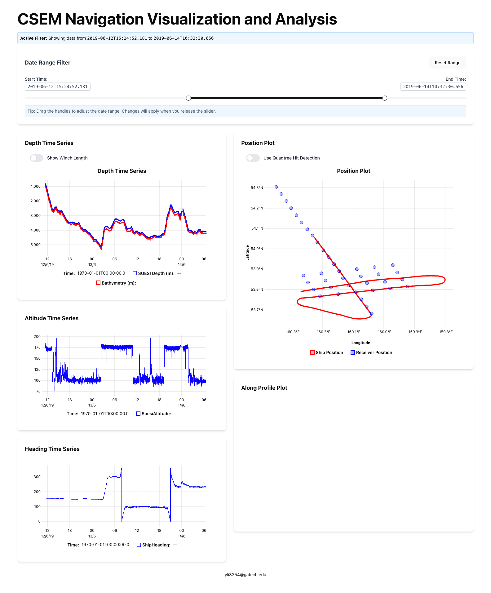
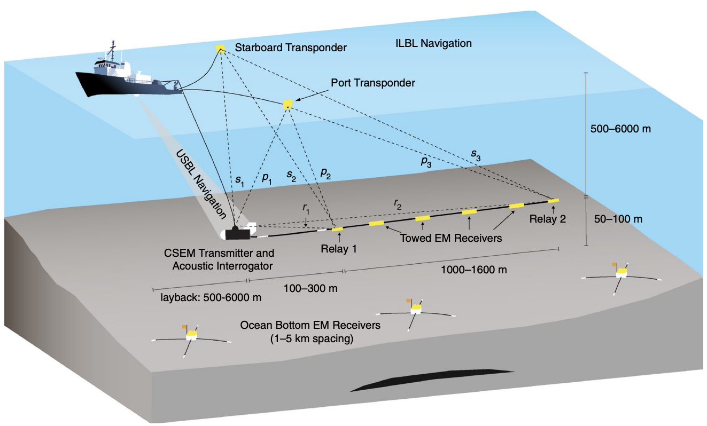

# CSEM Data Collection Visualization and Navigation Analysis

A web application for visualizing and analyzing Controlled Source Electromagnetic (CSEM) data collection. Interactive time series visualizations and spatial representations of position data will be helpful for understanding the data, data processing, and navigation.




(Figure credit: [Key and Constable, 2021](https://marineemlab.ucsd.edu/steve/bio/Barracuda.pdf))

## Usage

1. The application will load ship and receiver data automatically on startup (data is loaded from csv files in `public/data`; example data is provided in `public/data/ship_data_demo.csv` and `public/data/Rx_forearc.csv`)
2. Use the datetime slider to select specific time ranges for analysis
3. View different visualizations in each panel:
   - Time series
     - Depth (transmitter, ATET, and Vulcan)
     - Transmitter Altitude
     - Antenna Altitude
     - Ship Heading
     - ATET compass
     - Vulcan compass
     - Velocity
     - Range time
   - Map view position
     - Ship
     - Receiver
     - Starboard and Port Transponders (Barracudas)
     - Transmitter
     - Antenna
   - Profile (X:Distance to the Trench)
     - Depth (transmitter, ATET, and Vulcan)
     - Velocity
     - Receiver
     - Most time series data can also be visualized in the profile view

For more information about the navigation, please refer to the paper [Inverted long‑baseline acoustic navigation of deep‑towed CSEM transmitters and receivers (Key and Constable, 2021)](https://marineemlab.ucsd.edu/steve/bio/Barracuda.pdf).

## Try it out

### Prerequisites

- Node.js (v14 or higher recommended)
- bun

### Installation

1. Clone the repository

   ```bash
   git clone https://github.com/ycli0536/csemAA.git
   cd csemAA
   ```

2. Install dependencies

   ```bash
   bun install
   ```

3. Start the development server

   ```bash
   bun run dev
   ```

4. Open your browser and navigate to `http://localhost:5173` (or the port shown in your terminal)
